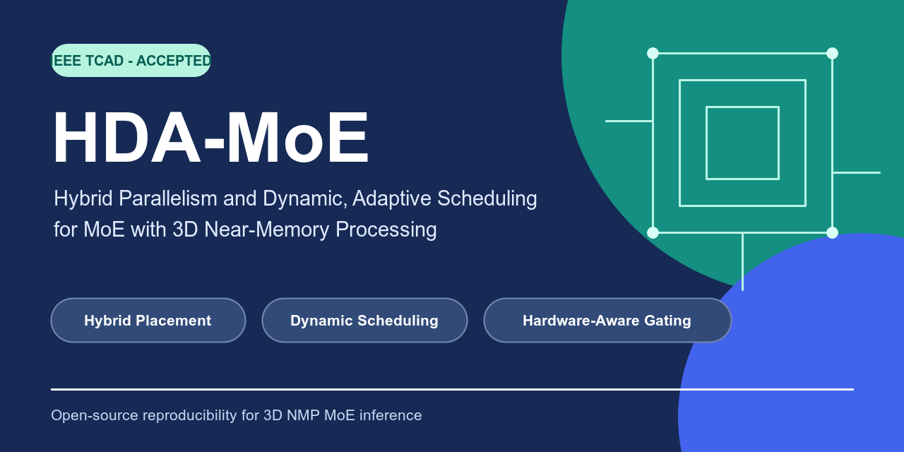
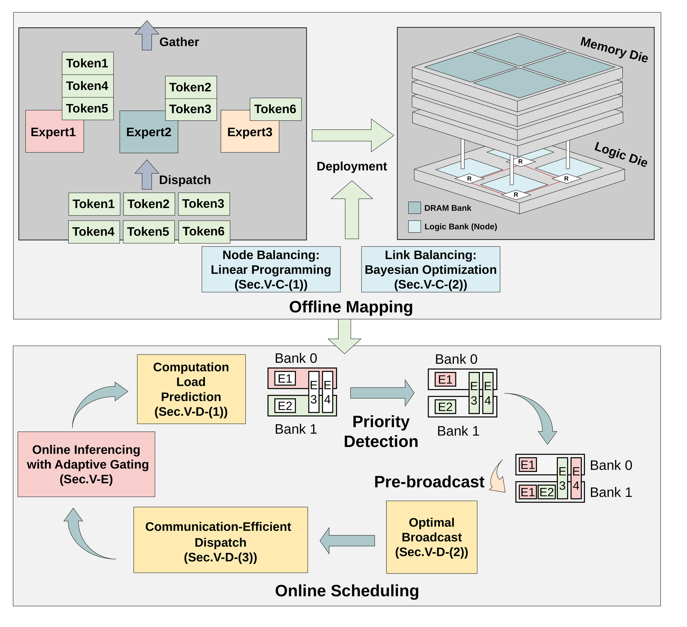
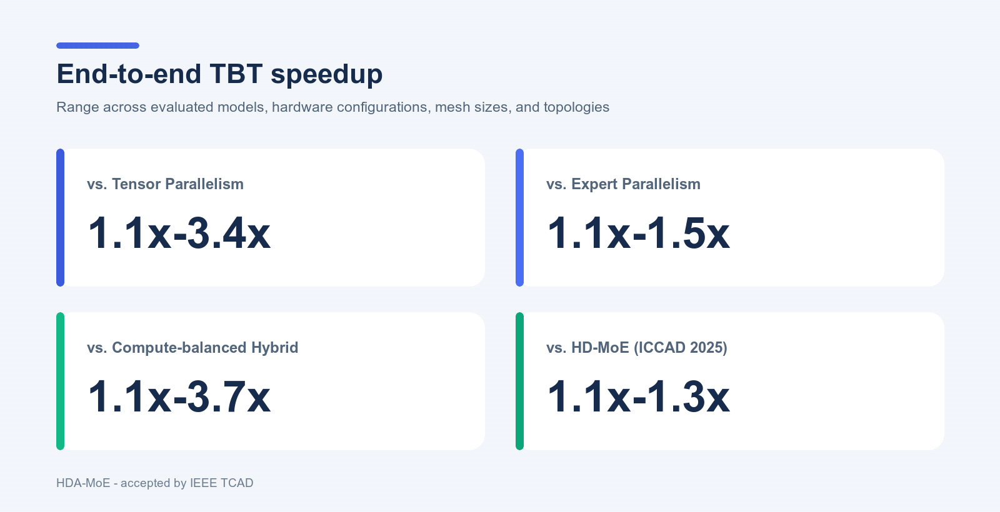

<p align="center">
  
</p>

<p align="center">
  <a href="https://ieeexplore.ieee.org/xpl/RecentIssue.jsp?punumber=43"></a>
  <a href="https://ieeexplore.ieee.org/document/11240984"></a>
  
  <a href="LICENSE"></a>
</p>

<p align="center">
  <strong>Hybrid Parallelism and Dynamic, Adaptive Scheduling for Mixture-of-Experts with 3D Near-Memory Processing</strong>
</p>

<p align="center">
  Haochen Huang, Shuzhang Zhong, Shengxuan Qiu, Zhe Zhang, Shuangchen Li, Cong Li,<br>
  Dimin Niu, Hongzhong Zheng, Guangyu Sun, Runsheng Wang, and Meng Li
</p>

<p align="center">
  &#127881; Accepted by <strong>IEEE Transactions on Computer-Aided Design of Integrated Circuits and Systems (TCAD)</strong>.
</p>

HDA-MoE is a deployment and runtime framework for efficient Mixture-of-Experts (MoE) inference on distributed 3D near-memory processing (NMP) systems. It co-optimizes expert placement, on-chip communication, runtime scheduling, and hardware-aware routing so that sparse MoE execution matches the compute, bandwidth, topology, and memory constraints of the target system.

This repository provides the minimal reproducible implementation for the accepted TCAD paper and builds on the conference work [HD-MoE](https://github.com/angerybob/HD-MoE) ([ICCAD 2025 paper](https://ieeexplore.ieee.org/document/11240984)).

## Highlights

- **End-to-end speedup:** 1.1x-3.4x over tensor parallelism, 1.1x-1.5x over expert parallelism, 1.1x-3.7x over compute-balanced hybrid TP-EP, and 1.1x-1.3x over HD-MoE.
- **Offline system-aware mapping:** jointly balances node computation, communication volume, link contention, and per-node expert-weight capacity.
- **Online adaptation:** combines hotspot-aware pre-broadcast scheduling with hardware-aware gating for time-varying expert activation.
- **Broad evaluation:** covers Mixtral, DeepSeek, Qwen2, and Qwen3.5 across Mesh, Torus, and Fat-tree interconnects.
- **Routing fidelity:** hardware-aware gating retains comparable task accuracy; non-Top-1 boundary substitutions reach 0.949 average output similarity across the four evaluated models.

## How HDA-MoE works

1. **Node Balance** formulates hybrid TP-EP expert placement as a capacity-aware linear program to reduce computation imbalance and communication volume.
2. **Link Balance** maps logical placements to physical nodes with topology-aware Bayesian optimization, reducing link congestion on Mesh, Torus, and Fat-tree networks.
3. **Dynamic Scheduling** predicts short-term expert hotspots and pre-broadcasts high-priority experts without adding token communication.
4. **Hardware-aware Gating** regularizes low-impact routing choices with marginal computation and communication costs while preserving the original routing weights.

## Overview

<p align="center">
  
</p>

HDA-MoE first generates an offline hybrid deployment that balances logical work and physical network traffic. At runtime, dynamic scheduling increases the available hardware supply for emerging hotspots, while hardware-aware gating reduces routing demand that would otherwise create new compute or communication bottlenecks.

## Results at a glance

<p align="center">
  
</p>

The figure summarizes the end-to-end time-between-token speedup ranges reported in the accepted paper across evaluated models, hardware configurations, mesh sizes, and interconnect topologies. Hardware-aware routing maintains comparable accuracy to the original gating policy.

## What is new over HD-MoE?

| Area | HD-MoE (ICCAD 2025) | HDA-MoE (TCAD) |
|---|---|---|
| Hybrid deployment | Node- and link-balanced placement | Capacity-aware placement with expanded system modeling |
| Runtime scheduling | Dynamic expert pre-broadcast | Dynamic scheduling plus adaptive routing |
| Expert routing | Original model gating | Hardware-aware computation and communication penalties |
| Interconnect scope | Mesh-oriented evaluation | Mesh, Torus, and Fat-tree simulation |
| Model fidelity | Performance-centered evaluation | Accuracy, routing retention, output similarity, KL, and perplexity analyses |
| Evaluation scope | Conference baselines and workloads | HD-MoE comparison, Qwen3.5, latency breakdown, scalability, and sensitivity studies |

## Repository map

| Component | Entry point | Purpose |
|---|---|---|
| Hybrid placement | `simulator.py`, `node_allocation.py` | Capacity-aware Node Balance and topology-aware Link Balance |
| Network model | `topology.py` | Mesh, Torus, and Fat-tree routing and link accounting |
| End-to-end evaluation | `evaluation/scripts/e2e_hda.py` | Compare TP, EP, hybrid, HD-MoE, and HDA-MoE latency |
| Gating replay | `evaluation/scripts/simulate_hd_gating_from_scores.py` | Replay hardware-aware gating from saved softmax traces |
| Trace conversion | `evaluation/scripts/trace_gating_softmax_to_npz.py` | Convert collected full-softmax traces to the replay format |
| Routing fidelity | `evaluation/scripts/routing_fidelity.py` | Measure expert substitutability and output perturbation |
| Model integration | `fastchat/fastchat/llm_judge/moe_gating_hd.py` | Shared HDA routing used during model inference |

## Quick start

### Installation

```bash
git clone --recursive https://github.com/angerybob/HDA-MoE.git
cd HDA-MoE

conda create -n hda-moe python=3.10 -y
conda activate hda-moe

# Select the PyTorch build that matches your CUDA environment.
pip install torch==2.6.0 torchvision==0.21.0 torchaudio==2.6.0
pip install -r requirements.txt
pip install -e "./fastchat[model_worker,llm_judge]"
```

The placement optimizer requires a valid [Gurobi](https://www.gurobi.com/) license. Gating replay and evaluation from the bundled artifacts can run without solving a new placement.

### Reproduce a bundled hardware-aware gating replay

The following command replays one Qwen2 layer at 5 TFLOPS and 50 GB/s. Small `--hd-comp` and `--hd-bw` values are interpreted as TFLOPS and GB/s, respectively.

```bash
python evaluation/scripts/simulate_hd_gating_from_scores.py \
  --scores-npz expert_trace/qwen/score/gating_score_reasoning.npz \
  --output-json /tmp/hda_qwen_replay.json \
  --model-name qwen --top-k 8 --layers 0 \
  --reward-comp -18000 --reward-comm -0.0001 \
  --hd-mesh-rows 4 --hd-mesh-cols 8 \
  --hd-comp 5 --hd-bw 50 --chunk-size 32 --device cpu
```

### Run an end-to-end topology evaluation

```bash
python evaluation/scripts/e2e_hda.py \
  --cwd . --model ds --batch 32 \
  --mesh 4 8 --comp 5 --bw 50 --topology mesh \
  --results-json /tmp/hda_e2e.json
```

Change `--topology` to `torus` or `fat_tree` to exercise the additional interconnect models. For a fresh offline placement, run `simulator.py` for the desired model, layer, hardware setting, topology, and optional `--memory-factor`; `optimizer.sh` is the multi-layer driver.

## Reproducibility paths

| Paper result | Reproducible path |
|---|---|
| Offline Node-Link Balance | `optimizer.sh` -> `simulator.py` -> `node_allocation.py` |
| Mesh/Torus/Fat-tree comparison | `evaluation/scripts/e2e_hda.py --topology ...` |
| Hardware-aware gating replay | `trace_gating_softmax_to_npz.py` -> `simulate_hd_gating_from_scores.py` |
| Inference-time HDA gating | FastChat `gen_model_answer.py` with the HDA options implemented in `moe_gating_hd.py` |
| Routing fidelity and substitutability | `evaluation/scripts/routing_fidelity.py` |
| HumanEval functional correctness | Bundled `human-eval` submodule |

The repository includes the routing traces and placement artifacts required by the bundled evaluations. Checkpoint-dependent fidelity evaluation requires the corresponding Hugging Face model checkpoint and is intentionally kept separate from the code release.

## Paper and citation

**HDA-MoE: Hybrid Parallelism and Dynamic, Adaptive Scheduling for Mixture-of-Experts with 3D Near-Memory Processing**<br>
Haochen Huang, Shuzhang Zhong, Shengxuan Qiu, Zhe Zhang, Shuangchen Li, Cong Li, Dimin Niu, Hongzhong Zheng, Guangyu Sun, Runsheng Wang, and Meng Li.<br>
Accepted by *IEEE Transactions on Computer-Aided Design of Integrated Circuits and Systems*.

The DOI and final IEEE Xplore link will be added after online publication. Until then, please use the accepted-manuscript citation:

```bibtex
@article{huang2026hdamoe,
  author  = {Haochen Huang and Shuzhang Zhong and Shengxuan Qiu and Zhe Zhang and
             Shuangchen Li and Cong Li and Dimin Niu and Hongzhong Zheng and
             Guangyu Sun and Runsheng Wang and Meng Li},
  title   = {{HDA-MoE}: Hybrid Parallelism and Dynamic, Adaptive Scheduling for
             Mixture-of-Experts with 3D Near-Memory Processing},
  journal = {IEEE Transactions on Computer-Aided Design of Integrated Circuits and Systems},
  year    = {2026},
  note    = {Accepted}
}
```

The conference predecessor is:

```bibtex
@inproceedings{huang2025hdmoe,
  author    = {Haochen Huang and Shuzhang Zhong and Zhe Zhang and Shuangchen Li and
               Dimin Niu and Hongzhong Zheng and Runsheng Wang and Meng Li},
  title     = {{HD-MoE}: Hybrid and Dynamic Parallelism for Mixture-of-Expert LLMs
               with 3D Near-Memory Processing},
  booktitle = {2025 IEEE/ACM International Conference on Computer-Aided Design (ICCAD)},
  year      = {2025},
  pages     = {1--9},
  doi       = {10.1109/ICCAD66269.2025.11240984}
}
```

## Acknowledgements

The model-evaluation path builds on [FastChat](https://github.com/lm-sys/FastChat), and functional-correctness evaluation builds on [HumanEval](https://github.com/openai/human-eval). Their original licenses are preserved in the corresponding submodules.

## License

The HDA-MoE code is released under the [MIT License](LICENSE). The FastChat and HumanEval submodules retain their respective Apache-2.0 and MIT licenses.
